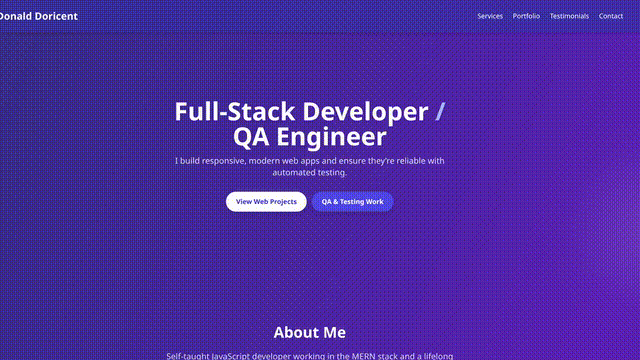

# Doricent Web Solutions

  

Web dev studio focused on clean, fast, conversion-ready sites for local businesses and creators.

**Live Site:** https://dondoricent.netlify.app  
**Contact:** DDoricent97@gmail.com (inquiries)  

---

## How It's Made

**Tech used:** HTML, CSS/SCSS, JavaScript (vanilla); lightweight tooling per project.

I keep client sites simple, fast, and maintainable. For each build I start with semantic HTML, accessible components, and mobile-first layout. CSS (or SCSS) handles design tokens and utilities; JavaScript adds just-enough interactivity (forms, nav, light dynamic content). Each project folder includes its own README with setup notes and a plan for future improvements.

---

## Optimizations

- Performance first: image compression, lazy loading, and minimal JS where possible.
- Accessibility passes: color contrast, focus states, keyboard nav, and ARIA where needed.
- Reusable bits: headers/footers, hero sections, and CTA blocks standardized across projects.
- Deployment-ready: clean file structure for quick pushes to Netlify/Vercel or simple static hosting.

---

## Lessons Learned

- Keep scope tight and ship: small iterations beat big redesigns.
- Accessibility isn’t an afterthought—bake it in from the first component.
- Content structure matters more than animations.
- Clients love clear READMEs and “what’s next” checklists.

---

## Examples

A few active builds and in-progress demos in this repo:

- **Clay & Petal** — Handmade pottery storefront and gallery  
  Code: [/clay-and-petal](./clay-and-petal)

- **Cordoba-Art** — Artist portfolio with commissions info  
  Code: [/cordoba-art](./cordoba-art)

- **Spectral Barber Shop** — Local service site with booking CTA  
  Code: [/SpectralBarberShop](./SpectralBarberShop)

- **Red Store Apparel** — Product landing & catalog demo  
  Code: [/RedStoreApparel](./RedStoreApparel)

- **ProjectNext** — Modern layout experiment / component library WIP  
  Code: [/ProjectNext](./ProjectNext)

---

## What’s Next

- Add live demo links for each project
- Lighthouse + a11y audits with fixes
- Convert shared components into a tiny starter kit
- Add tests for core JS utilities (urls, forms, modals)

---

## Running Locally

Most folders are static sites. Clone and open the `index.html` in your browser.  
If a project uses a dev server/bundler, see that folder’s README for commands.

